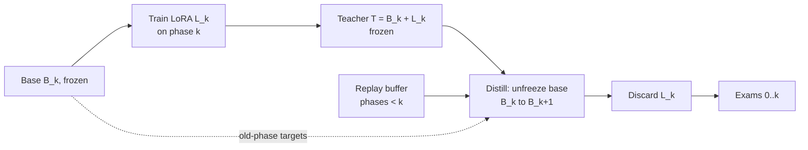

# Lifespan Model Experiment Plan

2026-09-20 · live copy: https://claude.ai/code/artifact/a0c89fc1-111f-48ab-ae5e-a42f1df1d3a1

A ~30M-parameter model learns the seven lifespan phases in order; the experiment
measures how much it forgets earlier phases under five training regimes, and
whether sleep-style consolidation (frozen LoRA distilled into the base with
replay) beats plain replay. Runs on Kaggle's free GPU quota or a few dollars of
rented A100; nothing trains on the laptop.

## Hypotheses and kill criteria

The experiment tests one claim: a frozen per-phase LoRA, distilled into the base
weights with replay of earlier phases, retains earlier phases at least as well as
interleaved-replay fine-tuning, at no more than 1.5x its compute. Thresholds are
fixed here, before any run, and the plan is committed with the code (Holdout's
rule applied to ourselves).

| Hypothesis | Confirmed if | Killed if |
| --- | --- | --- |
| H1 Forgetting is real at this scale | Arm A (sequential, no replay) loses >= 15% of its peak phase-0 exam score by the end of phase 6 | Arm A loses < 5%: the phases are too similar or the exams too easy to test anything; fix the curriculum first |
| H2a Consolidation beats plain replay on retention | Arm D's average forgetting <= Arm B's, and final average accuracy within 3 points of Arm E (joint oracle) | Arm D forgets more than Arm B |
| H2b What that retention costs | Not a pass/fail test. The measured GPU-time ratio of Arm D to Arm B, reported against the <= 1.5x and > 2x bands the original H2 named | -- |
| H3 Distillation is needed, merging is not enough | Arm D beats Arm C (arithmetic merge) by >= 5 points average accuracy | Arm C matches Arm D: reverse-LoRA is just W += BA and the distillation step is dropped |
| H4 Replay is the active ingredient | Arm D without replay forgets clearly more than Arm D with replay | No difference: the consolidation alone preserves old phases, which would be a surprising and publishable result on its own |

H2 was one hypothesis until 2026-09-22, joining retention to a compute ceiling of
1.5x Arm B. It was split before any run, on the owner's decision, because the two
clauses could not both be satisfied by the algorithm this plan specifies: the
consolidation step is a 1-unit LoRA day plus a night of two frozen teacher
forwards and a student step, which the *Budget* paragraph below already puts at
2.5-3x Arm A, and Arm B measures 1.375x Arm A -- so Arm D is 1.8-2.2x Arm B by
construction, and no implementation reaches 1.5x. Splitting keeps the retention
claim falsifiable on its own evidence and turns the cost into what it always
was, a measured number. The bands are unchanged and H2b is reported against
them. See docs/DECISIONS.md, 2026-09-22.

Every comparison uses 3 seeds and reports mean and standard deviation. A
difference smaller than the seed spread is reported as no difference; Reflex's
bench showed what an underpowered n costs.

## Model and compute

A GPT-2-style decoder of about 30M parameters, trained from scratch, with a small
BPE tokenizer trained on the story corpus so the embedding matrix does not
dominate the parameter count.

| Choice | Value | Why |
| --- | --- | --- |
| Architecture | 8 layers, 512 hidden, 8 heads, 1,024-token context | TinyStories showed this size produces coherent stories; small enough that every arm runs many times |
| Tokenizer | 8k–16k BPE trained on the corpus | A 50k GPT-2 vocab would put ~25M parameters in embeddings alone |
| Precision | bf16 on A100, fp16 with loss scaling on T4 | Kaggle's GPUs are T4s and lack bf16 |
| LoRA (arms C, D) | rank 16 on attention and MLP projections, alpha 32 | Standard; rank is an open question below |
| Optimizer | AdamW, cosine schedule per phase, warmup 200 steps | Restart the schedule at each phase so every arm sees the same per-phase budget |

Compute estimate, per unit (one full pass through 7 phases at 4 epochs each,
~85M token-passes): about 1.5e16 FLOPs, roughly 25–40 minutes on a T4 or 5–8
minutes on an A100. Arm D costs about 3 units (LoRA training plus distillation);
the whole grid (5 arms + 1 ablation, 3 seeds) is roughly 35 units.

| Option | Cost | Constraint |
| --- | --- | --- |
| Kaggle | Free; 30 GPU-hours per week, 12-hour session cap, T4 x2 or P100 | ~15–25 T4-hours total, so it fits in one or two weeks of quota; checkpoint after every phase to a Kaggle dataset because a session can die |
| Rented A100 (RunPod, Lambda, Vast) | Roughly $1.50–2.50 per hour at the time of writing; verify before booking | ~4–6 hours for the full grid, so the whole experiment is in the tens of dollars |

Recommendation: pilot on Kaggle (free, and the pipeline needs to survive session
restarts anyway), run the final 3-seed grid on one rented A100 in a single sitting
so every run shares hardware and driver versions, which matters for the
reproduction rule below.

## Data

The experiment measures remembering, not capability, so it needs far fewer
stories than TinyStories did: 5,000 training stories per phase for the pilot,
35,000 total, scaled to 20,000 per phase only if Arm A shows no forgetting (H1
killed).

| Set | Per phase | Source | Held out? |
| --- | --- | --- | --- |
| Training stories | 5,000 (~3M tokens) | The existing prompt generator, seed 42, responses from Gemini Flash | No |
| Replay buffer | 500, sampled from training | Fixed subset, chosen once, same across arms | No (it is training data) |
| Exam stories | 500 | Same generator, a different seed, generated in a separate run | Yes |
| Exam probes | 500 | Built from exam stories, see Evaluation | Yes |

Rules for the exam sets, so that a score means what it says:

- Exams are generated by a separate invocation with a separate seed and written
  to a directory the training script cannot see; the manifest records the
  SHA-256 of every exam file.
- Any story whose first 200 characters match a training story is dropped from
  the exam set (near-duplicate check, done once, logged).
- The exam set is frozen before the first training run and never regenerated; a
  change to the exams is a new experiment.

Generation cost: 35,000 training stories plus 3,500 exam stories at roughly 600
output tokens each is about 23M output tokens. Look up the current Gemini Flash
output price before generating; at 2025 Flash prices this was in the tens of
dollars, and Gemini's batch mode is cheaper still. Generate one phase first
(5,500 stories) and check length, age-appropriateness and tone before spending
the rest.

One quality gate is cheap and worth having: a Laya-style typed decision per story
("is this story appropriate for a reader aged N?" as a score) run over the pilot
phase, to catch a generator that ignores the age in the prompt. Stories that fail
are regenerated, and the pass rate is recorded per phase.

## Training arms

Five regimes plus one ablation, all starting from the same randomly initialised
checkpoint per seed, all seeing the same per-phase token budget (4 epochs over
that phase's 5,000 stories).

| Arm | Regime | What it establishes |
| --- | --- | --- |
| A | Sequential full fine-tune, phase 0 to 6, no replay | The naive baseline; the forgetting that everything else is measured against |
| B | Sequential full fine-tune with interleaved replay: 30% of every batch drawn from the replay buffers of earlier phases | The standard remedy and the bar Arm D has to clear |
| C | Base frozen after phase 0; one LoRA per phase 1–6 trained on the frozen base, merged arithmetically (W += BA) after each phase | The null hypothesis for reverse-LoRA: merging without training |
| D | Consolidation: LoRA per phase, frozen, then distilled into the base with replay (the algorithm in the next section) | The sleep mechanism |
| D-nr | Arm D with the replay term removed | Isolates what replay contributes versus the distillation itself |
| E | Joint training on all seven phases shuffled together, same total tokens | The upper bound; how much any sequential method leaves on the table |

Housekeeping that keeps the arms comparable:

- Every arm evaluates on all seven exam sets after every phase, so each run
  produces a 7 x 7 matrix (phase trained x phase examined).
- Arm A is a subset of Arm B with replay fraction 0; implement them as one script
  with a flag so they cannot drift.
- Arms C and D share the LoRA training code; only what happens after the LoRA is
  frozen differs.
- Seeds 0, 1, 2 for every arm. Seed controls init, data order and LoRA init; the
  data itself is fixed.
- Phase 0 is ordinary full training for every sequential arm (decided
  2026-09-21). A rank-16 LoRA on a frozen, randomly initialised base cannot
  learn a language, so the consolidation recipe starts at phase 1. Phase 0 is
  trained once per seed and the checkpoint is shared by A, B, C, D and D-nr, so
  every forgetting curve starts from the same model and any gap between arms
  comes from phases 1–6. The phase-0 wall clock is copied into each arm's
  timings so H2's compute ratio is not distorted. Arm E trains jointly from the
  random init and does not use it.
- Replay is on top of the token budget, not inside it (decided 2026-09-21).
  Every arm takes the same number of optimizer steps per phase, each with the
  same N new-phase sequences; arms with replay add about 0.43 N replay sequences
  to the batch, so replay is 30% of the batch and the warmup and cosine schedule
  are identical across arms. Arm B therefore processes about 1.43x Arm A's
  tokens, which its GPU-hours record. Arm D's distillation step follows the same
  rule; Arm D-nr adds no replay sequences. Arm E's "same total tokens" means
  Arm A's total: 7 phases x 4 epochs.

## The consolidation step

One "day" is a phase; one "night" is the consolidation. The LoRA is the fast
learner (hippocampus), the base is the slow store (cortex), and the night replays
both the day's material and a sample of older days.



Read left to right: the day trains only the LoRA; the night trains only the base,
toward two teachers.

1. Freeze base B_k. Train LoRA L_k on phase k stories with the ordinary
   language-model loss, same token budget as the other arms.
2. Freeze L_k. The teacher for phase-k material is T = B_k + L_k.
3. Unfreeze the base and train it toward:

   ```latex
   \mathcal{L} = \underbrace{\mathrm{KL}\big(T \,\|\, B_{k+1}\big)}_{\text{phase } k \text{ stories}} + \lambda \underbrace{\mathrm{KL}\big(B_k \,\|\, B_{k+1}\big)}_{\text{replay, phases } < k}
   ```

   Lambda = 1, batches mixed 70% phase-k and 30% replay. The replay targets are
   the previous base's own logits, not the stored text's labels: the old model is
   the exact record of what it knew (Dream-RSI's "history is the world it dreams
   in"). Both teachers cost one forward pass each.
4. Discard L_k. Run all exams 0..k. Proceed to phase k+1 with B_{k+1} as the new
   frozen base.

Budget: step 1 costs one unit-phase, step 3 about 1.5 (two teacher forwards plus
the student), so Arm D is about 2.5–3x Arm A. If H2 holds only at the 3x cost,
the honest conclusion is that consolidation buys retention for compute, and the
product question becomes whether that trade is worth it.

Why this and not simply merging: W += BA is exact for a single LoRA, so Arm C
should match Arm D on the phase just learned. The difference, if there is one,
appears in the earlier phases, where repeated merges interfere and nothing
replays them. That is what H3 measures.

## Evaluation

Every exam is scored by log-likelihood, never by generation, so scores are
deterministic and cheap: one forward pass per item, no sampling, no judge model
in the loop.

| Exam | Built from | Score | What it catches |
| --- | --- | --- | --- |
| Held-out perplexity | 500 exam stories per phase | Mean per-token loss | Broad drift; the continuous signal for the forgetting curve |
| Lexicon cloze | Exam stories with a phase-lexicon word masked | Rank-1 accuracy of the true word among the phase's lexicon | Whether the phase's vocabulary survives |
| Continuation choice | A story prefix plus the true next paragraph and three distractors from other phases' stories | Accuracy: true continuation has the highest log-likelihood | Whether the phase's reasoning level and tone survive |
| Judge grade (secondary, optional) | 100 generated stories per phase, graded by an LLM for age-appropriateness and coherence | 1–10 | Sanity check on generation quality only; noisy, never a hypothesis metric |

Each run produces a 7 x 7 matrix M where M[i][j] is the accuracy on phase j's
exams after training phase i. From it, the three standard continual-learning
numbers:

- Average accuracy = mean of the last row (after phase 6, across all phases).
- Forgetting of phase j = max over i of M[i][j] minus M[6][j]; average
  forgetting is the mean over j < 6. This is the number H1–H4 are stated in.
- Forward transfer of phase j = M[j-1][j] minus the untrained model's score on
  phase j: whether earlier phases make later ones easier, which the curriculum
  claims.

Plots, one per exam type: the 7 x 7 matrix as a heatmap per arm, and the
forgetting curve (phase-0 exam score after each phase) with one line per arm and
seed spread as a band.

Reproduction rule: a result counts only when a second run from the named commit,
with the recorded seed, data hashes and environment, reproduces the matrix within
seed spread. The pilot on Kaggle and the final grid on a rented A100 are two
hardware setups, which is a useful first test of the rule. This is Holdout's
Level 1 applied to the project's own claims, and the experiment doubles as the
first non-toy submission when Holdout runs a continual-learning bounty.

## Schedule

Four weeks of evenings and weekends; the pilot runs free on Kaggle, the final
grid costs one rented-GPU session.

| Week | Ships | Gate to next week |
| --- | --- | --- |
| 1 | Repo changes below; exam generator and holdout manifest; one phase (5,500 stories) generated and inspected; the Laya age-check pass rate recorded | Stories read as age-appropriate and the exam directory is provably disjoint from training |
| 2 | Remaining six phases generated; tokenizer; model and training script with the arm flag; Arms A and E on a 1,000-story-per-phase pilot on Kaggle | Arm A forgets on the pilot (H1 holds), or the curriculum goes back for revision before any more spend |
| 3 | LoRA, merge and consolidation code; Arms C, D, D-nr on the pilot; then the full grid, 6 arms x 3 seeds, in one rented-A100 session with per-phase checkpoints saved | All 18 runs complete with matrices and timings logged |
| 4 | Reproduction run of the two headline arms from the commit; heatmaps and forgetting curves; a results section appended to this doc with H1–H4 marked confirmed or killed | Two runs reproduce within seed spread |

If week 2's gate fails, the fix is to the curriculum (more distinct phases,
harder exams), not to the model, and week 3 slips by however long that takes.

## Changes to the curriculum-learning repo

The repo generates the training side only; it needs an exam side, a response
pipeline and a few fixes before week 1 ends.

- [ ] Add a `split` field (`train` | `exam`) to prompt metadata and a `--split`
      flag to `generate_prompts.py`; exam runs take their own seed and write to a
      separate directory.
- [ ] Write a holdout manifest: SHA-256 of every exam file, the generator commit,
      seed and config hashes; the training script refuses to start if any
      training file's hash appears in the manifest.
- [ ] Replace `response/scratch.py` with a batch response generator: reads a
      prompt jsonl, calls Gemini Flash (batch mode where available), writes
      `{prompt_hash, phase, tier, story, model, timestamp}` per line, resumable,
      with retries.
- [ ] Lexicons: `Phase.__init__` expects `config/lexicons/phase_{id}.json` for
      all seven phases, but `phases.yaml` lists a `lexicon_path` only for phases
      0–2 and the extractor has processed one book. Build lexicons for phases 3–6
      from tier-appropriate texts before generating those phases, or the later
      prompts will carry early-phase vocabulary.
- [ ] Exam probe builder: from the exam stories, produce the lexicon-cloze and
      continuation-choice items (distractors sampled from other phases' exam
      stories, never training stories).
- [ ] A `training/` package, separate from `dataset_generation/`: tokenizer
      training, model definition, the arm-flagged training loop, LoRA and
      consolidation, evaluation, and a Kaggle notebook that calls it and
      checkpoints per phase. (Per `CLAUDE.md`, this lives in the Lifespan repo,
      not in curriculum-learning.)
- [ ] Age-check gate: a script that runs a Laya `score` question over generated
      stories and reports pass rate per phase; failures are queued for
      regeneration.
- [ ] Rename or remove the stale `childhood_curriculum_learning.egg-info` so the
      package name is unambiguous.

## Open questions and extensions

Decisions to make before week 3, and what to try only after H1–H4 are settled.

- LoRA rank: 16 is the default; if Arm C and D differ from Arm B by more than
  seed spread on the phase just learned, the LoRA is capacity-limited and rank
  goes to 32 for both.
- Lambda and replay fraction: 1.0 and 30% are fixed for the grid; a sweep is a
  follow-up, not part of the experiment.
- Replay targets: the plan uses the previous base's logits. The stored text's
  labels are the simpler alternative; if they perform the same, use them and
  drop the second teacher forward.
- Judge grading: only if a reader of the results asks whether the stories are any
  good; it is not needed to decide H1–H4.

Extensions, each its own experiment after this one:

- Exam-gated promotion (AdA's frontier curriculum): advance to phase k+1 only
  when phase-k exams pass a threshold, and compare total tokens to the fixed
  schedule. This is the developmental claim of the lifespan project and deserves
  its own kill criteria.
- Pure dreaming: replay from stories the previous base generates itself, with no
  stored buffer. If it retains as well as the buffer, the episodic store is
  unnecessary and the sleep phase needs no diary.
- Many-LoRA interference: train all six LoRAs on the phase-0 base and merge them
  at once (TIES/DARE-style) against sequential consolidation; this is the case
  where merging is known to fail and consolidation should win most clearly.
- Holdout: once the matrix and the reproduction rule exist, the same exam sets
  and evaluation code become a continual-learning bounty type where the metric
  (average forgetting on held-out phases, reproduced from commit) is code, which
  answers the vision doc's third falsifier for one bounty type.
